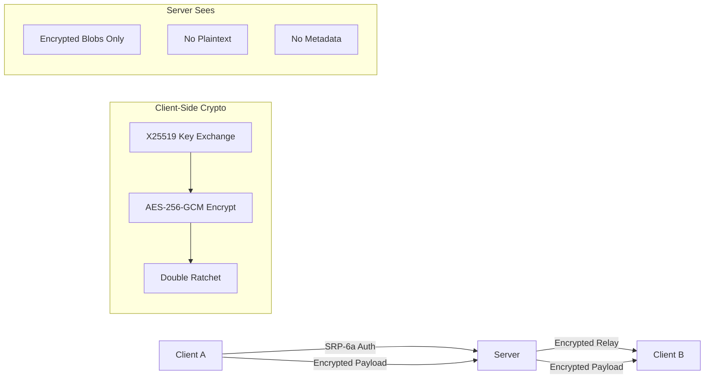
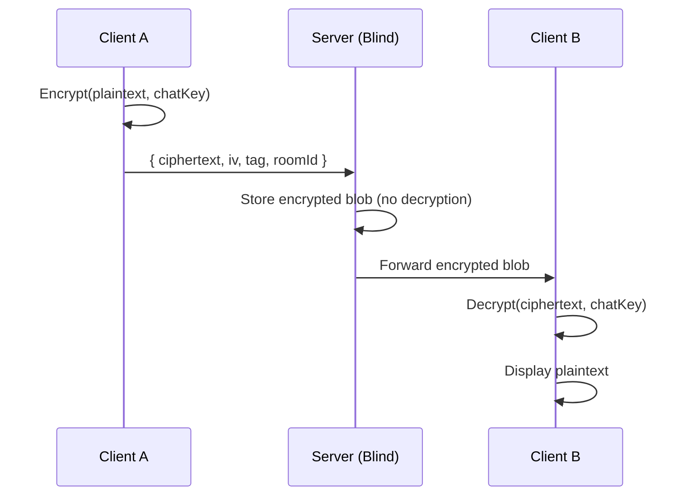

<div align="center">


# ZEVRA

### Zero-Knowledge Encrypted Communication Protocol

**Privacy is not a feature. It's the architecture.**

[](LICENSE)
[]()
[]()
[]()
[]()
[]()

[**Live App**](https://zevra-chat.netlify.app/) · [**Architecture**](./app/architecture/page.tsx) · [**About**](./app/about/page.tsx)

</div>

---

## Overview

Zevra is a zero-knowledge, end-to-end encrypted communication suite built for individuals who demand uncompromising privacy. Every message, call, and file transfer is sealed with client-side cryptography — the server never sees plaintext, metadata, or keys.

**Problem:** Centralized messaging platforms store plaintext on servers, expose metadata to third parties, and rely on trust-based encryption that can be compromised by subpoenas, insider threats, or breaches.

**Solution:** Zevra implements a zero-knowledge architecture where all cryptographic operations happen on the client. The server is a dumb relay — it routes encrypted blobs without ever possessing the ability to decrypt them.

### High-Level Architecture



---

## Features

- **Zero-Knowledge Server** — Server never sees plaintext, keys, or metadata
- **SRP-6a Authentication** — Password-authenticated key exchange (RFC 5054, 2048-bit MODP)
- **X25519 Key Agreement** — Elliptic-curve Diffie-Hellman for session keys
- **AES-256-GCM Encryption** — Authenticated encryption for all messages and files
- **Ed25519 Digital Signatures** — Key integrity and identity verification
- **Double Ratchet Protocol** — Forward secrecy with per-message key derivation
- **Group E2EE** — Multi-party encrypted conversations with member-specific keys
- **Ephemeral In-Memory Storage** — Messages stored in client-side IndexedDB only
- **Self-Destructing Buffers** — Volatile RAM buffers purge on session close
- **Peer-to-Peer Mesh** — Direct connections where possible, relay fallback
- **WebRTC + LiveKit** — Encrypted voice/video calls with SFU fallback
- **Real-Time Presence** — Typing indicators, online status, read receipts
- **Zero Telemetry** — No connection logging, behavioral tracking, or analytics

---

## Cryptographic & Security Architecture

### Key Management

| Layer | Algorithm | Purpose |
|-------|-----------|---------|
| Authentication | **SRP-6a** (RFC 5054, 2048-bit MODP) | Password-based auth without exposing password |
| Key Exchange | **X25519** (Curve25519) | Ephemeral Diffie-Hellman session keys |
| Digital Signature | **Ed25519** | Key integrity and identity proof |
| Symmetric Encryption | **AES-256-GCM** | Authenticated encryption (128-bit IV, 128-bit tag) |
| Key Derivation | **PBKDF2** (100K iterations, SHA-256) | Password → key material |
| Key Wrapping | **AES-KW** | Protect stored cryptographic keys |

### Threat Model

```
┌─────────────────────────────────────────────────────────┐
│                    WHAT THE SERVER SEES                  │
│                                                         │
│  ✓ Encrypted ciphertext (base64)                        │
│  ✓ IV + Auth tag (base64)                               │
│  ✓ Username (hashed)                                    │
│  ✓ Room/channel IDs                                     │
│  ✓ Connection timestamps                                │
│                                                         │
├─────────────────────────────────────────────────────────┤
│                  WHAT THE SERVER NEVER SEES              │
│                                                         │
│  ✗ Plaintext messages                                   │
│  ✗ Encryption keys                                      │
│  ✗ Message content                                      │
│  ✗ File/media content                                   │
│  ✗ User passwords                                       │
│  ✗ Key exchange parameters                              │
│  ✗ Call audio/video streams                             │
└─────────────────────────────────────────────────────────┘
```

### Data Flow — Encrypted Message Delivery



---

## Tech Stack

| Layer | Technology |
|-------|------------|
| **Frontend** | Next.js 16, React 19, TypeScript 5 |
| **Styling** | Tailwind CSS 4, Motion (Framer) |
| **State** | Zustand 5 (persisted to localStorage) |
| **Real-Time** | Socket.IO 4 (WebSocket transport) |
| **IndexedDB** | Dexie 4 (client-side message/key storage) |
| **Crypto** | Web Crypto API, @noble/curves, @noble/hashes |
| **Voice/Video** | WebRTC (peer-to-peer), LiveKit (SFU fallback) |
| **3D/Shader** | OGL (Plasma WebGL background) |
| **Scrolling** | Lenis (smooth scroll), entity-react-marquee |
| **Icons** | react-icons |
| **HTTP** | Axios (with token interceptors) |
| **Linting** | OxLint |
| **Package Manager** | Bun 1.3+ |

---

## System Prerequisites

| Requirement | Minimum Version |
|-------------|-----------------|
| **Node.js** | 18.x |
| **Bun** | 1.3.x |
| **TypeScript** | 5.x |

> [!NOTE]
> This is the **client** application. You need the [Zevra server](https://github.com/BazilSuhail/ZEVRA) running separately for full functionality.

### Environment Variables

Create a `.env.local` file in the project root:

```bash
# API Configuration
NEXT_PUBLIC_API_URL=http://localhost:5000    # Backend server URL

# Crypto Parameters (configured in constants/index.ts)
# AES-256-GCM | 256-bit keys | 12-byte IV | 16-byte tag
# PBKDF2: 100,000 iterations | SHA-256
```

> [!IMPORTANT]
> The `NEXT_PUBLIC_API_URL` must point to your Zevra backend server. All cryptographic operations happen client-side — the server URL only handles encrypted relay.

---

## Getting Started

### 1. Clone the repository

```bash
git clone https://github.com/BazilSuhail/ZEVRA.git
cd ZEVRA
```

### 2. Install dependencies

```bash
bun install
```

### 3. Configure environment

```bash
cp .env.example .env.local
# Edit .env.local with your server URL
```

### 4. Start development server

```bash
bun run dev
```

The app will be available at [http://localhost:3000](http://localhost:3000).

### 5. Build for production

```bash
bun run build
bun run start
```

> [!WARNING]
> The chat features (`/chat`) require a running backend server. Without it, only the marketing pages (home, about, architecture) will function.

---

## API & WebSocket Protocol

### REST Endpoints (via Axios client)

| Method | Endpoint | Purpose |
|--------|----------|---------|
| `POST` | `/api/auth/register` | Register new account |
| `POST` | `/api/auth/login` | SRP-6a login (start + finish) |
| `GET` | `/api/auth/me` | Validate token / get profile |
| `PUT` | `/api/users/me` | Update profile |
| `GET` | `/api/keys` | Fetch encryption keys |
| `POST` | `/api/keys/rotate` | Rotate key version |
| `GET` | `/api/audit` | Security audit log |

### Socket Events

| Event | Direction | Purpose |
|-------|-----------|---------|
| `send-message` | Client → Server | Send encrypted payload |
| `message:new` | Server → Client | Receive encrypted payload |
| `typing:start` / `typing:stop` | Bidirectional | Typing indicators |
| `call:initiate` | Client → Server | Start WebRTC/LiveKit call |
| `call:offer` / `call:answer` | Bidirectional | SDP exchange |
| `call:ice-candidate` | Bidirectional | ICE candidate exchange |
| `livekit:token-request` | Server → Client | Request LiveKit SFU token |
| `heartbeat-ack` | Server → Client | Connection keepalive |

---

## Security & Vulnerability Reporting

If you discover a security vulnerability, please report it responsibly:

- **Email**: Contact via [GitHub Issues](https://github.com/BazilSuhail/ZEVRA/issues)
- **Do NOT** open public issues for security vulnerabilities
- Include steps to reproduce, affected version, and potential impact
- We aim to respond within 48 hours

> [!TIP]
> All cryptographic primitives are implemented using well-audited libraries (@noble/curves, @noble/hashes) and the native Web Crypto API. Custom implementations (SRP-6a, key wrapping) follow published RFCs.

---

## Contributing

1. Fork the repository
2. Create a feature branch (`git checkout -b feature/amazing-feature`)
3. Commit changes (`git commit -m 'Add amazing feature'`)
4. Push to branch (`git push origin feature/amazing-feature`)
5. Open a Pull Request

### Code Style

- TypeScript strict mode
- Functional components with hooks
- Zustand for state management (no Redux)
- Tailwind CSS for styling (no CSS modules)
- ESLint via OxLint

---

## License

MIT License — see [LICENSE](LICENSE) for details.

---

<div align="center">

**Built with mathematical certainty, not trust.**

[**Try Zevra →**](https://zevra-chat.netlify.app/)

</div>
